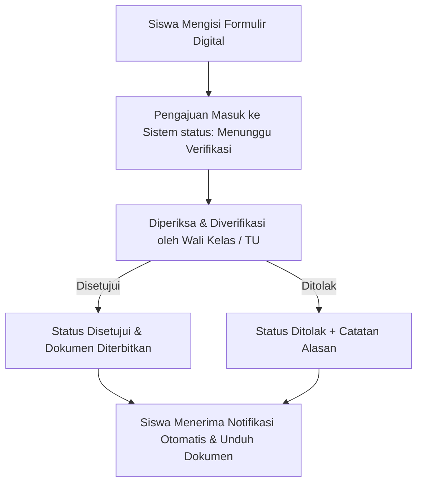

# Product Requirements Document (PRD) — SchoolAdmin

**Nama Aplikasi**: SchoolAdmin  
**Platform**: Web Application (Digitalisasi Administrasi Sekolah & Asisten AI)  
**Versi Dokumen**: 1.0  
**Status**: Core Product Reference  

---

## 1. Deskripsi Ringkas Produk (Overview)
**SchoolAdmin** adalah aplikasi web yang mendigitalisasi dan mempermudah proses administrasi sekolah. Berbagai urusan administrasi yang sebelumnya dilakukan secara manual (harus tatap muka atau datang langsung ke Ruang Tata Usaha / TU) kini dapat diajukan, diproses, dan dipantau secara digital dan real-time melalui satu platform terpadu.

---

## 2. Peran Pengguna (Target Users)
Aplikasi ini menghubungkan 3 peran utama di lingkungan sekolah:
1. **Siswa**: Pengguna yang mengajukan surat, izin, dispensasi, serta memantau status pengajuan dan absensi pribadi.
2. **Guru / Wali Kelas**: Memeriksa, menyetujui, atau menolak pengajuan izin/dispensasi siswa di kelas yang diampu.
3. **TU / Admin**: Mengelola seluruh pengajuan dari semua kelas, menerbitkan dokumen resmi, mengelola data siswa, dan melihat statistik administrasi sekolah.

---

## 3. Fitur Utama (Core Features)

1. **Data Siswa**:
   - Pengelolaan data identitas siswa meliputi Nama, Kelas, NIS/NISN, serta Data Kontak Orang Tua / Wali.
2. **Pengajuan Administrasi**:
   - Formulir digital pengajuan surat keterangan, izin tidak hadir, dan dispensasi kegiatan.
3. **Absensi & Perizinan**:
   - Siswa dapat mengajukan izin tidak hadir (sakit/keluarga) dan guru/wali kelas dapat memeriksa serta menyetujuinya secara langsung.
4. **Dokumen**:
   - Penyimpanan terpusat dan pengelolaan surat/dokumen hasil pengajuan yang disetujui sekolah.
5. **Notifikasi**:
   - Pengiriman notifikasi otomatis (*in-app*) saat status pengajuan berubah (menunggu verifikasi, diproses, disetujui, atau ditolak).
6. **Dashboard Admin (TU)**:
   - Dashboard monitoring terpusat bagi Tata Usaha untuk melihat, menyetujui/menolak, mengekspor rekap, dan mengelola seluruh pengajuan sekolah.

---

## 4. Cara Kerja Utama (Core Workflow)

1. **Siswa** mengisi formulir digital di aplikasi sesuai jenis pengajuan.
2. **Pengajuan** otomatis masuk ke sistem dengan status *Menunggu Verifikasi*.
3. **Wali Kelas / TU** memeriksa pengajuan beserta lampiran pendukung.
4. **Wali Kelas / TU** memberikan keputusan (*Disetujui* atau *Ditolak* dengan catatan alasan).
5. **Siswa** menerima notifikasi mengenai hasil keputusan dan dapat mengunduh dokumen resmi jika disetujui.

---

## 5. Penggunaan AI (AI Assistant Scope)

AI pada **SchoolAdmin** diposisikan secara eksplisit sebagai **Asisten Administrasi**, bukan pengambil keputusan. Decision-making tetap 100% di tangan Wali Kelas / TU.

### Peran & Fitur AI:
- **Informasi Syarat Dokumen**: Memberitahu dokumen pendukung yang diperlukan untuk suatu jenis pengajuan.
- **Pencarian Informasi & Prosedur**: Membantu menjawab pertanyaan seputar alur dan ketentuan administrasi sekolah.
- **Ringkasan Laporan Administrasi**: Membantu membuat ringkasan rekap pengajuan dan statistik untuk TU.
- **Pengingat Proaktif**: Memberikan pengingat mengenai tenggat pengajuan atau kelengkapan dokumen.

---

## 6. Analisis Kelebihan & Tantangan

### Kelebihan (Advantages):
- Lebih praktis dan menghemat waktu siswa, guru, maupun TU.
- Mengurangi penggunaan kertas (Paperless).
- Transparansi status pengajuan real-time bagi siswa dan orang tua.
- Data administrasi sekolah lebih terorganisir, terpusat, dan mudah diaudit.

### Kekurangan / Tantangan (Challenges):
- Membutuhkan koneksi internet dan perangkat di lingkungan sekolah.
- Memerlukan standar keamanan data yang baik untuk melindungi data sensitif siswa.
- Membutuhkan pemeliharaan sistem berkelanjutan.
- Pengguna (siswa, guru, TU) memerlukan waktu adaptasi dengan alur digital baru.

---

## 7. Kesimpulan (Inti Produk)
> **SchoolAdmin = Satu aplikasi terpadu untuk mengelola berbagai kebutuhan administrasi sekolah secara digital, dengan AI sebagai asisten informasi.**
